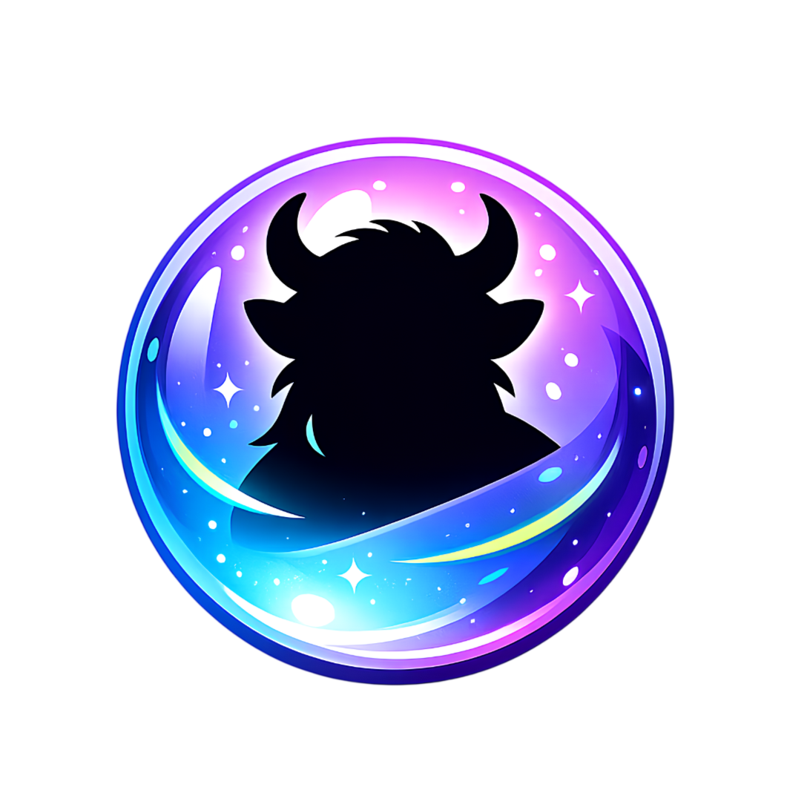

# 🌿 Stillwalks — Juego Idle contra el Sedentarismo

<p align="center">
  
</p>

<p align="center">
  <strong>Desconecta del móvil. Camina. Descubre criaturas místicas.</strong>
</p>

<p align="center">
  
  
  
  
  
</p>

<p align="center">
  <a href="README_EN.md">🇬🇧 English Version</a>
</p>

---

## 📖 Tabla de Contenidos

- [Descripción General](#-descripción-general)
- [Probar la App (Sin ser desarrollador)](#-probar-la-app-sin-ser-desarrollador)
- [Stack Tecnológico](#-stack-tecnológico)
- [Requisitos Previos](#-requisitos-previos)
- [Instalación y Ejecución](#-instalación-y-ejecución)
- [Estructura del Proyecto](#-estructura-del-proyecto)
- [Funcionalidades Principales](#-funcionalidades-principales)
- [Nomenclatura del Juego](#-nomenclatura-del-juego)
- [Criaturas Disponibles](#-criaturas-disponibles)
- [Sistema de Progresión](#-sistema-de-progresión)
- [Permisos Android](#-permisos-android)
- [Comandos Útiles](#-comandos-útiles)
- [Estado del Proyecto e Ideas Futuras](#-estado-del-proyecto-e-ideas-futuras)
- [Licencia](#-licencia)
- [Autor](#-autor)

---

## 🌟 Descripción General

**Stillwalks** es una aplicación móvil para Android que combina las mecánicas de un **juego idle/incremental** con el fomento de la **actividad física**.

### ¿Cómo funciona?

El concepto es sencillo:

1. **Incremental**: El jugador gana **Esencia** (la moneda del juego) al puro estilo "clicker", al principio haciendo tap en la pantalla y después automatizando cada vez más la recolección de Esencia.
2. **Actividad Física**: Con esa Esencia, el jugador compra **Orbes** que se colocan en **Santuarios**. Para que un Orbe canalice y revele una criatura (**Stillwalk**), es necesario **caminar** un cierto número de pasos reales.

### El ciclo de juego

```
🔒 Haz tap (o espera) → 💎 Gana Esencia → 🔮 Compra Orbes → 🏛️ Colócalos en Santuarios
     → 🚶 Camina → ✨ Canaliza el Orbe → 🐾 Descubre un Stillwalk → 📖 Completa tu Diario
```

El objetivo final es completar el **Diario de Explorador** descubriendo todas las criaturas disponibles, mientras se incentiva un estilo de vida activo.

---

## 📱 Probar la App (Sin ser desarrollador)

Si solo quieres probar Stillwalks sin compilar nada:

1. Descarga el archivo `.apk` más reciente desde la sección de [Releases](../../releases) del repositorio (o solicítalo al autor).
2. Copia el `.apk` a tu dispositivo Android.
3. Abre el archivo en tu dispositivo. Es posible que necesites habilitar la opción **"Instalar desde fuentes desconocidas"** en los ajustes de seguridad de tu Android.
4. Una vez instalada, abre la app y sigue el tutorial incluido.

> **Nota:** Se requiere Android 8.0 (Oreo) o superior.

---

## 🛠️ Stack Tecnológico

| Tecnología | Uso | Versión |
|---|---|---|
| **Flutter** | Framework de UI multiplataforma | 3.38+ |
| **Dart** | Lenguaje de programación principal | 3.10+ |
| **Kotlin** | Código nativo Android (servicios en background) | — |
| **SQLite** (sqflite) | Base de datos local para persistencia del juego | 2.3+ |
| **Provider** | Gestión de estado reactivo | 6.1+ |
| **Pedometer** | Conteo de pasos mediante sensores del dispositivo | 4.0+ |
| **Health Connect** | Integración con Google Fit / Health Connect | 13.3+ |
| **SharedPreferences** | Almacenamiento de preferencias del usuario | 2.2+ |
| **home_widget** | Widget nativo en la pantalla de inicio de Android | 0.9+ |
| **flutter_native_splash** | Splash screen nativo al iniciar la app | 2.3+ |
| **flutter_launcher_icons** | Generación automática de iconos de la app | 0.13+ |
| **package_info_plus** | Lectura de información del paquete (versión, etc.) | 8.0+ |
| **intl** | Internacionalización (i18n) y formateo de datos | — |

### Arquitectura

La app sigue una arquitectura basada en **servicios** con gestión de estado mediante **Provider**:

```
┌────────────────────────────────┐
│          Screens (UI)          │  ← Pantallas de usuario
├────────────────────────────────┤
│          Providers             │  ← Gestión de estado (Provider)
├────────────────────────────────┤
│          Services              │  ← Lógica de negocio
├────────────────────────────────┤
│          Models                │  ← Modelos de datos
├────────────────────────────────┤
│      Data (SQLite + Seeds)     │  ← Persistencia
├────────────────────────────────┤
│    Código Nativo (Kotlin)      │  ← Servicios Android (pasos, bloqueo)
└────────────────────────────────┘
```

---

## 📋 Requisitos Previos

Antes de poder compilar y ejecutar el proyecto, necesitas instalar las siguientes herramientas:

### 1. Flutter SDK (v3.38 o superior)

1. **Descargar Flutter**:
   - Visita la guía oficial: [https://docs.flutter.dev/get-started/install](https://docs.flutter.dev/get-started/install)
   - Selecciona tu sistema operativo y sigue las instrucciones.
   - Descarga y extrae el Flutter SDK en una carpeta (ej: `C:\src\flutter` en Windows).

2. **Añadir Flutter al PATH del sistema**:
   - **Windows**: Busca "Variables de entorno" en el menú inicio → Edita la variable `Path` del usuario → Añade la ruta `<tu_ruta>\flutter\bin`.
   - **macOS/Linux**: Añade `export PATH="$PATH:<tu_ruta>/flutter/bin"` a tu archivo `~/.bashrc`, `~/.zshrc` o equivalente.

3. **Verificar la instalación**:
   ```bash
   flutter doctor
   ```
   Este comando te indicará si te falta algún componente.

### 2. Android Studio

1. Descarga e instala [Android Studio](https://developer.android.com/studio).
2. Durante la instalación, asegúrate de incluir:
   - **Android SDK** (API 26 o superior)
   - **Android SDK Platform-Tools**
   - **Android SDK Build-Tools**
   - **Android Emulator** (opcional, para pruebas sin dispositivo físico)
3. Acepta las licencias de Android:
   ```bash
   flutter doctor --android-licenses
   ```

### 3. Dispositivo o Emulador

- **Dispositivo físico**: Conecta tu dispositivo Android por USB y habilita la **depuración USB** en las opciones de desarrollador.
- **Emulador**: Crea un dispositivo virtual desde Android Studio (AVD Manager) con API 26+.

> **Nota:** Algunas funcionalidades nativas (conteo de pasos, tracking de bloqueo de pantalla) solo funcionan correctamente en un **dispositivo físico**.

---

## 🚀 Instalación y Ejecución

Una vez tienes Flutter y Android Studio configurados:

```bash
# 1. Clonar el repositorio
git clone <url-del-repositorio>
cd stillwalks

# 2. Obtener las dependencias del proyecto
flutter pub get

# 3. Ejecutar en un dispositivo Android conectado o emulador
flutter run

# 4. (Opcional) Compilar un APK de debug para instalar manualmente
flutter build apk --debug
```

El APK generado se encontrará en `build/app/outputs/flutter-apk/app-debug.apk`.

### Posibles problemas

| Problema | Solución |
|---|---|
| `flutter doctor` muestra errores | Sigue las instrucciones que indica el propio comando para resolver cada punto |
| Error de licencias Android | Ejecuta `flutter doctor --android-licenses` y acepta todas |
| No detecta el dispositivo | Verifica que la depuración USB está habilitada y los drivers instalados |
| Error de compilación Kotlin | Asegúrate de tener Java 17 configurado en Android Studio |

---

## 📁 Estructura del Proyecto

```
stillwalks/
│
├── android/                            # Código nativo Android
│   └── app/src/main/kotlin/
│       └── com/stillwalks/app/
│           ├── MainActivity.kt             # Activity principal + Method Channel
│           ├── ScreenLockTracker.kt         # Detección de bloqueo/desbloqueo de pantalla
│           ├── StepCounterService.kt        # Servicio de conteo de pasos en background
│           ├── TrackingForegroundService.kt  # Servicio foreground para tracking persistente
│           ├── StillwalksWidget.kt          # Widget nativo de pantalla de inicio
│           ├── StillwalksNotificationManager.kt # Gestión de notificaciones nativas
│           ├── NotificationChannels.kt      # Definición de canales de notificación
│           ├── BootReceiver.kt              # Reinicio automático de servicios tras reboot
│           └── WalkReminderWorker.kt        # Recordatorios periódicos de caminar
│
├── lib/                                # Código Flutter (Dart)
│   ├── main.dart                           # Punto de entrada de la aplicación
│   │
│   ├── models/                             # Modelos de datos
│   │   ├── player_state.dart                   # Estado global del jugador (esencia, XP, nivel, etc.)
│   │   ├── upgrade.dart                        # Mejoras comprables (7 tipos definidos)
│   │   ├── building.dart                       # Edificios generadores de esencia (5 tipos)
│   │   ├── orbe.dart                           # Orbes (tipos y instancias)
│   │   ├── sanctuary.dart                      # Santuarios (permanentes y temporales)
│   │   ├── creature_species.dart               # Especies de Stillwalks (datos estáticos)
│   │   ├── creature_instance.dart              # Instancias de criaturas descubiertas
│   │   ├── inventory_item.dart                 # Objetos del inventario (bolsa)
│   │   └── notification_settings.dart          # Configuración de notificaciones
│   │
│   ├── services/                           # Lógica de negocio
│   │   ├── esencia_service.dart                # Generación de esencia, compras, XP, nivel
│   │   ├── orbe_service.dart                   # Gestión de orbes, santuarios, canalización
│   │   ├── progression_service.dart            # Sistema de niveles, desbloqueos, caps de mejoras
│   │   ├── collection_service.dart             # Gestión de la colección de criaturas
│   │   ├── step_aggregator_service.dart        # Agregación de pasos de múltiples fuentes
│   │   ├── google_fit_service.dart             # Integración con Google Fit / Health Connect
│   │   ├── native_bridge.dart                  # Comunicación Flutter ↔ Kotlin (Method Channel)
│   │   ├── hatching_service.dart               # Lógica de eclosión de orbes
│   │   ├── tutorial_service.dart               # Gestión del tutorial inicial
│   │   ├── widget_service.dart                 # Sincronización con widget nativo
│   │   ├── active_time_tracker.dart            # Tracking de tiempo activo en la app
│   │   ├── permission_service.dart             # Gestión de permisos del sistema
│   │   ├── notification_guard_service.dart     # Control de frecuencia de notificaciones
│   │   └── notification_preferences_service.dart # Preferencias de notificaciones
│   │
│   ├── screens/                            # Pantallas de la interfaz
│   │   ├── home_screen.dart                    # Pantalla principal (esencia, tap, santuarios)
│   │   ├── shop_screen.dart                    # Tienda (orbes, mejoras, edificios)
│   │   ├── channeling_screen.dart              # Animación de canalización de orbes
│   │   ├── explorer_journal_screen.dart        # Diario de explorador (colección)
│   │   ├── sanctuary_screen.dart               # Gestión detallada de santuarios
│   │   ├── inventory_screen.dart               # Inventario / Bolsa del jugador
│   │   ├── settings_screen.dart                # Pantalla de ajustes
│   │   ├── help_screen.dart                    # Guía de ayuda dentro del juego
│   │   ├── credits_screen.dart                 # Créditos del proyecto
│   │   ├── sensors_screen.dart                 # Diagnóstico de sensores
│   │   ├── tracking_status_screen.dart         # Estado del tracking en background
│   │   ├── permissions_screen.dart             # Solicitud de permisos iniciales
│   │   ├── permissions_status_screen.dart      # Estado de permisos concedidos
│   │   ├── google_fit_screen.dart              # Configuración de Google Fit
│   │   ├── language_selection_screen.dart       # Selección de idioma
│   │   └── widgets/                            # Sub-widgets reutilizables
│   │       ├── sanctuary_slot_widgets.dart          # Slots de santuarios (principal)
│   │       ├── tutorial_manager.dart                # Gestor del flujo tutorial
│   │       ├── tutorial_overlay.dart                # Overlay visual del tutorial
│   │       ├── floating_essence_text.dart           # Texto flotante de esencia ganada
│   │       ├── random_essence_orb.dart              # Orbes de esencia aleatoria
│   │       ├── level_up_dialog.dart                 # Diálogo de subida de nivel
│   │       ├── shop_shortcut_button.dart            # Botón de acceso rápido a la tienda
│   │       └── shortcut_button.dart                 # Botón de atajo genérico
│   │
│   ├── data/                               # Capa de datos
│   │   ├── database/
│   │   │   └── database_helper.dart            # Helper SQLite (crear tablas, CRUD)
│   │   └── seeds/
│   │       └── initial_data.dart               # Datos iniciales del juego (criaturas, orbes, mejoras)
│   │
│   ├── l10n/                               # Internacionalización
│   │   ├── app_es.arb                          # Traducciones en español (idioma principal)
│   │   ├── app_en.arb                          # Traducciones en inglés
│   │   ├── app_localizations.dart              # Clase generada automáticamente
│   │   ├── app_localizations_es.dart           # Localización generada (ES)
│   │   ├── app_localizations_en.dart           # Localización generada (EN)
│   │   └── data_localizations.dart             # Traducciones de datos dinámicos del juego
│   │
│   ├── providers/                          # Proveedores de estado
│   │   └── locale_provider.dart                # Proveedor de locale para cambio de idioma
│   │
│   └── widgets/                            # Widgets globales
│       └── tutorial_dialog.dart                # Diálogo del tutorial
│
├── assets/                             # Recursos gráficos
│   ├── creatures/                          # Sprites de las criaturas (PNG)
│   │   ├── yedrantia.png
│   │   ├── trasgueco.png
│   │   ├── harijaun.png
│   │   ├── lierpes.png
│   │   ├── velanta.png
│   │   └── gamusarra.png
│   ├── ui/                                 # Elementos de interfaz
│   │   └── stillwalks-logo.png                 # Logo de la aplicación
│   └── animations/                         # (Reservado para futuras animaciones)
│
├── documentation/                      # Documentación interna del diseño
│   ├── GAME_GUIDE.md                       # Guía del juego
│   ├── ECONOMY_PROGRESSION.md              # Diseño de la economía y progresión
│   ├── DEV_GUIDE.md                        # Guía para desarrolladores
│   ├── CHANGE_DESIGN.md                    # Historial de cambios de diseño
│   ├── CREATURES_TYPES                     # Definición de tipos de criaturas
│   ├── FLUTTER_INSTALL_GUIDE.md            # Guía de instalación de Flutter
│   ├── PROGRESION_NIVELES.txt              # Detalles de progresión por niveles
│   ├── MVP.txt                             # Planificación del MVP
│   ├── unlocks_and_costs.md                # Tabla de desbloqueos y costes
│   └── ...                                 # Otros documentos de balance y diseño
│
├── test/                               # Tests
│   ├── progression_logic_test.dart         # Tests de lógica de progresión
│   └── widget_test.dart                    # Test básico de widgets
│
├── pubspec.yaml                        # Dependencias y configuración del proyecto
├── l10n.yaml                           # Configuración de internacionalización
├── analysis_options.yaml               # Reglas de análisis estático de Dart
├── Makefile                            # Atajos de compilación y ejecución
└── README.md                           # Este archivo
```

---

## ⚙️ Funcionalidades Principales

### 1. 💎 Sistema de Esencia (Moneda del juego)

- **Generación activa (Tap)**: El jugador puede hacer tap en la pantalla principal para generar esencia manualmente, con un cooldown configurable.
- **Edificios generadores**: Se pueden comprar edificios (Recolector, Mina, Cantera, Yacimiento, Fábrica) que generan esencia de forma continua.
- **Límite offline**: Máximo 12 horas de esencia acumulable estando offline (configurable según nivel del explorador).
- **Lluvia de Esencia**: Evento especial que se activa al alcanzar ciertos hitos.

### 2. 🔮 Sistema de Orbes y Canalización

- **Tipos de Orbes**: Tres tiers disponibles:
  - **Orbe Básico** (2.000 pasos) — Predominan criaturas comunes.
  - **Orbe Avanzado** (5.000 pasos) — Mayor probabilidad de criaturas poco comunes y raras.
  - **Orbe Experto** (10.000 pasos) — Mayor probabilidad de criaturas raras, épicas y míticas.
- **Bolsa de Orbes**: Los orbes comprados se almacenan en una bolsa antes de ser asignados a un santuario.
- **Canalización**: Cuando un orbe completa los pasos requeridos, el jugador puede "canalizar" para revelar la criatura, con una animación dedicada.

### 3. 🏛️ Sistema de Santuarios

- **Santuario Permanente** (Santuario Primordial): Incluido desde el inicio, se puede mejorar su velocidad (hasta 12 niveles, reduciendo pasos requeridos hasta un 24%).
- **Santuarios Temporales**: Se compran en la tienda y tienen usos limitados con efectos especiales:
  - *Flujo Rápido*: -10% pasos requeridos.
  - *Simbiosis*: +1 Esencia cada 10 pasos dados.
  - *Quietud Absoluta*: Permite eclosión con Esencia en lugar de pasos.

### 4. 👣 Tracking de Pasos

- **Sensor nativo**: Conteo de pasos mediante el sensor del dispositivo (pedómetro hardware), gestionado por `StepCounterService` en Kotlin.
- **Background tracking**: Servicio foreground que mantiene el conteo activo incluso con la app cerrada.
- **Google Fit / Health Connect**: Integración opcional para sincronizar pasos desde Health Connect (Android 14+).
- **Almacén de pasos**: Los pasos se acumulan en una "batería" y se consumen al progresar los orbes activos en los santuarios.

### 5. 📖 Diario de Explorador (Colección)

- Registro visual de todas las criaturas descubiertas.
- Las criaturas no descubiertas aparecen como siluetas.
- Cada criatura tiene nombre, descripción, rareza y número de Dex.

### 6. 🛒 Tienda y Mejoras

Las mejoras disponibles incluyen:

| Mejora | Descripción | Niveles |
|---|---|---|
| Recolector de Esencia | Aumenta la velocidad de generación pasiva | Hasta 12 |
| Almacén de Energía | Incrementa la capacidad de pasos almacenables | Hasta 12 |
| Fuerza de Tap | Aumenta la esencia ganada por tap | Hasta 30 |
| Ritmo Interior | Reduce el cooldown entre taps | Hasta 5 |
| Flujo de Esencia | Multiplicador global de esencia | Hasta 20 |
| Eco Persistente | Mejora la eficiencia de esencia offline | Hasta 15 |
| Memoria Persistente | Aumenta el tiempo máximo de acumulación offline | Hasta 15 |

Además se pueden comprar **edificios** con producción automática de esencia:

| Edificio | Producción Base | Coste Base |
|---|---|---|
| Recolector | 0.1/s | 100 |
| Mina | 0.5/s | 750 |
| Cantera | 2.0/s | 4.000 |
| Yacimiento | 7.5/s | 15.000 |
| Fábrica | 25.0/s | 75.000 |

### 7. 📊 Sistema de Progresión (Nivel de Explorador)

- Sistema de niveles basado en **XP** obtenida por acciones del juego (comprar mejoras, canalizar orbes, etc.).
- Cada nivel desbloquea nuevas mejoras, edificios, tipos de orbes y aumenta los caps de mejoras existentes.
- La progresión controla qué contenido está disponible en la tienda.

### 8. 🌐 Internacionalización (i18n)

- Soporte completo para **Español** 🇪🇸 e **Inglés** 🇬🇧.
- Cambio de idioma desde los ajustes de la app.
- Implementado con el sistema oficial de Flutter (`flutter_localizations` + archivos `.arb`).

### 9. 📱 Widget de Pantalla de Inicio

- Widget nativo de Android que muestra información del juego directamente en la pantalla de inicio.
- Se actualiza cada 15 minutos.

### 10. 🔔 Sistema de Notificaciones

- Notificaciones configurables para hitos de esencia, orbes listos para canalizar, y recordatorios de caminar.
- Sistema de control de frecuencia para evitar notificaciones excesivas.

### 11. 🎓 Tutorial Interactivo

- Tutorial paso a paso para nuevos jugadores que guía a través de las mecánicas principales.
- Overlay visual con indicaciones sobre los elementos de la interfaz.

---

## 📝 Nomenclatura del Juego

El juego utiliza una terminología propia inspirada en la temática mística. Es importante utilizarla de forma consistente:

| Término del Juego | Equivalente Conceptual | Descripción |
|---|---|---|
| **Esencia** | Moneda/Recurso | Moneda principal, se obtiene dejando el móvil bloqueado |
| **Orbes** | "Huevos" | Contienen criaturas, requieren pasos para eclosionar |
| **Santuarios** | "Incubadoras" | Donde se colocan los Orbes para su desarrollo |
| **Canalizar** | "Eclosionar" | Proceso de completar un Orbe y revelar la criatura |
| **Stillwalks** | Criaturas | Las criaturas coleccionables |
| **Diario de Explorador** | Pokédex / Colección | Registro de todas las criaturas descubiertas |
| **Edificios** | Generadores | Estructuras que producen esencia automáticamente |

---

## 🐾 Criaturas Disponibles

| # | Nombre | Rareza | Probabilidad (Orbe Básico) |
|---|---|---|---|
| 1 | **Yedrantía** | Común | 43% |
| 2 | **Trasgüeco** | Común | 43% |
| 3 | **Harijaun** | Poco Común | 11% |
| 4 | **Lierpes** | Épico | 1% |
| 5 | **Velanta** | Raro | 2% |
| 0 | **Gamusarra** | Mítico | — (Tutorial) |

> Todas las criaturas están inspiradas en mitología y folclore ibérico.

---

## 📈 Sistema de Progresión

El jugador avanza de nivel mediante **XP** obtenida por diversas acciones. Cada nivel desbloquea contenido nuevo:

- **Nuevos edificios y tipos de orbes** según se sube de nivel.
- **Caps de mejoras** que se incrementan con el nivel del explorador, controlados por `ProgressionService`.
- **Santuarios temporales** que se desbloquean en niveles específicos.

Para más detalles sobre la economía y la progresión, consulta la carpeta `/documentation/`, en particular:
- `ECONOMY_PROGRESSION.md` — Diseño económico detallado.
- `unlocks_and_costs.md` — Tabla completa de desbloqueos y costes por nivel.
- `PROGRESION_NIVELES.txt` — Definición de niveles y XP necesaria.

---

## 🔐 Permisos Android

La app requiere los siguientes permisos, todos justificados por funcionalidades del juego:

| Permiso | Razón |
|---|---|
| `ACTIVITY_RECOGNITION` | Conteo de pasos mediante el sensor del dispositivo |
| `FOREGROUND_SERVICE` / `FOREGROUND_SERVICE_HEALTH` | Servicio en segundo plano para tracking continuo |
| `WAKE_LOCK` | Mantener servicios activos durante el sueño del dispositivo |
| `RECEIVE_BOOT_COMPLETED` | Reiniciar automáticamente los servicios tras reiniciar el dispositivo |
| `POST_NOTIFICATIONS` | Enviar notificaciones del juego al jugador |
| `health.READ_STEPS` / `health.WRITE_STEPS` | Integración opcional con Google Fit / Health Connect |

---

## 💻 Comandos Útiles

```bash
# Obtener/actualizar dependencias
flutter pub get

# Ejecutar en modo debug
flutter run

# Compilar APK de debug
flutter build apk --debug

# Compilar APK de release
flutter build apk --release

# Ejecutar tests
flutter test

# Analizar código (lint)
flutter analyze

# Formatear código
dart format .

# Limpiar build
flutter clean
```

---

## 🔮 Estado del Proyecto e Ideas Futuras

### Estado Actual: MVP Funcional ✅

El proyecto se encuentra en su **primer MVP funcional**. La APK es completamente jugable de principio a fin y permite validar la idea central del juego. Todas las mecánicas principales están implementadas y funcionando.

### Ideas para Futuras Versiones

- [ ] Migración a **iOS** (minimizando la dependencia de código Kotlin nativo).
- [ ] Más criaturas y tipos de orbes.
- [ ] Eventos temporales y desafíos semanales.
- [ ] Mayor variedad de santuarios temporales.
- [ ] Animaciones de canalización mejoradas.
- [ ] Sistema de logros.
- [ ] Modo oscuro / temas visuales.
- [ ] Publicación en **Google Play Store**.
---

## 📄 Licencia

Este proyecto utiliza una **licencia dual**:

- **Código fuente**: Licenciado bajo la [GNU General Public License v3.0 (GPL-3.0)](LICENSE). Puedes usar, modificar y distribuir el código siempre que mantengas la misma licencia y no se utilice con fines comerciales implícitos sin cumplir las obligaciones de la GPL.

- **Recursos gráficos** (imágenes de criaturas, logo, UI): Las imágenes incluidas en la carpeta `assets/` han sido **generadas con Inteligencia Artificial** y se distribuyen bajo la licencia [Creative Commons Attribution-NonCommercial 4.0 International (CC BY-NC 4.0)](https://creativecommons.org/licenses/by-nc/4.0/). Esto significa que puedes compartir y adaptar estos recursos siempre que se dé crédito al autor y **no se utilicen con fines comerciales**.

---

## 👤 Autor

**Adrián Cámara Muñoz**

---

<p align="center">
  <i>Stillwalks — Desconecta. Camina. Descubre. 🌿</i>
</p>
